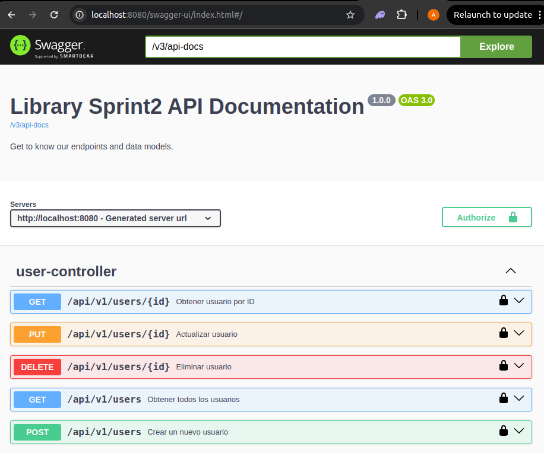
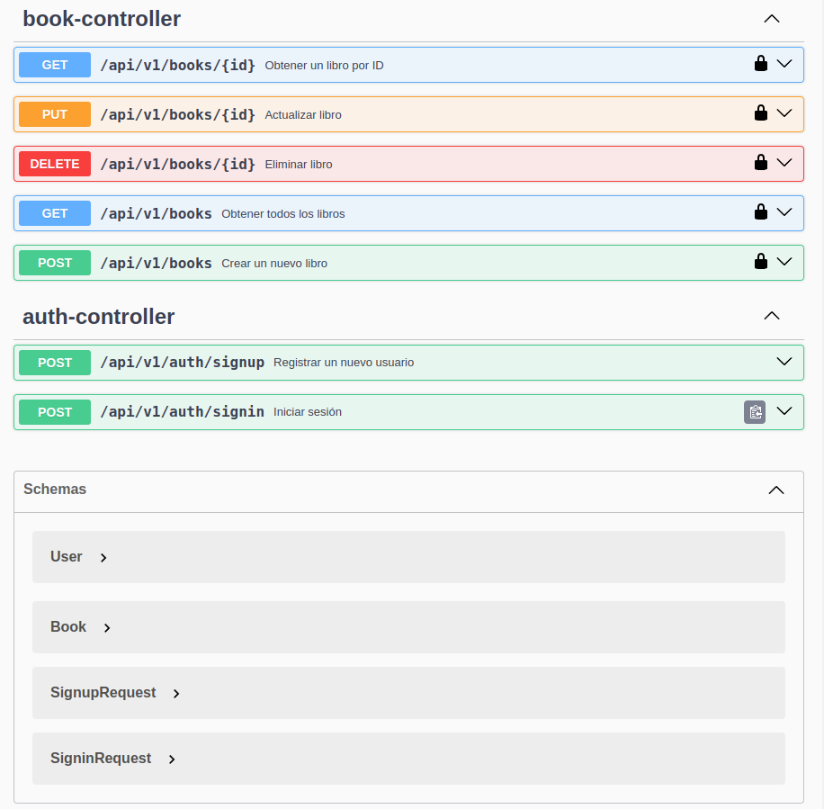
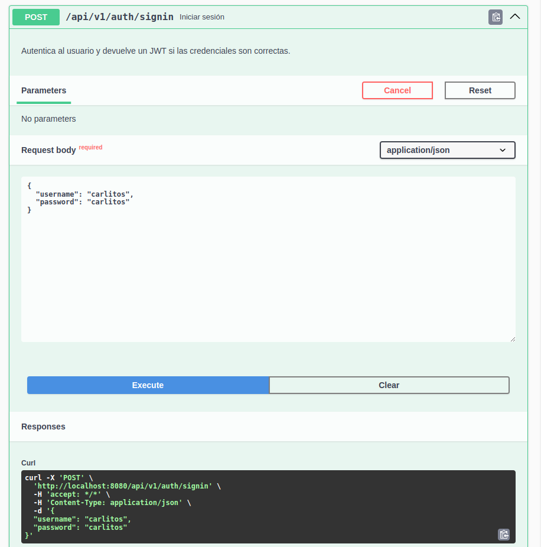
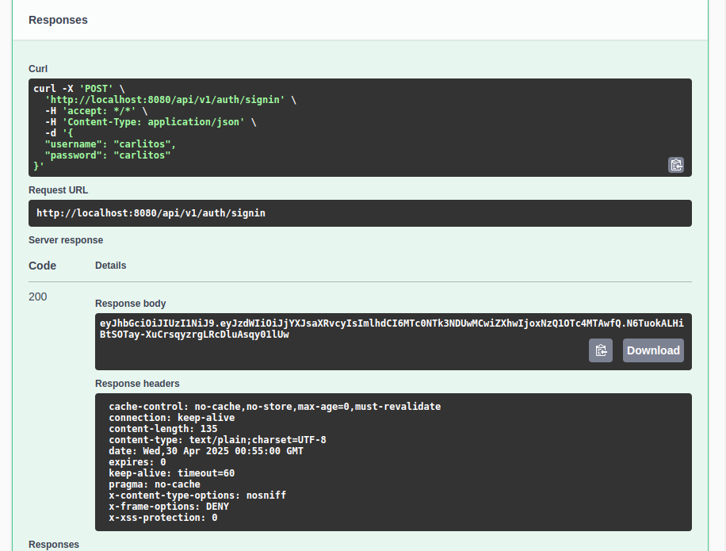
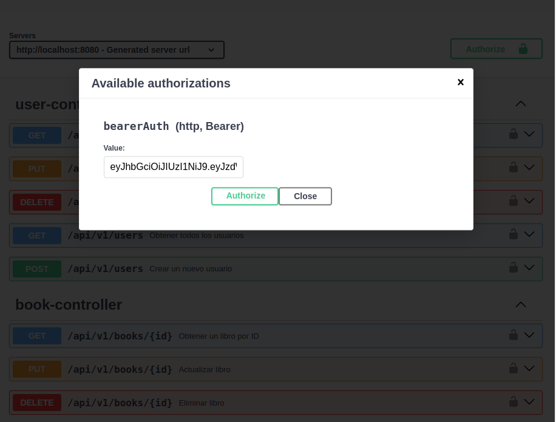
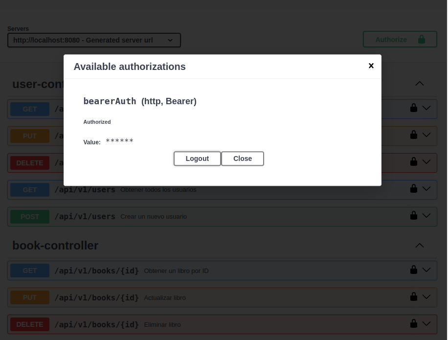
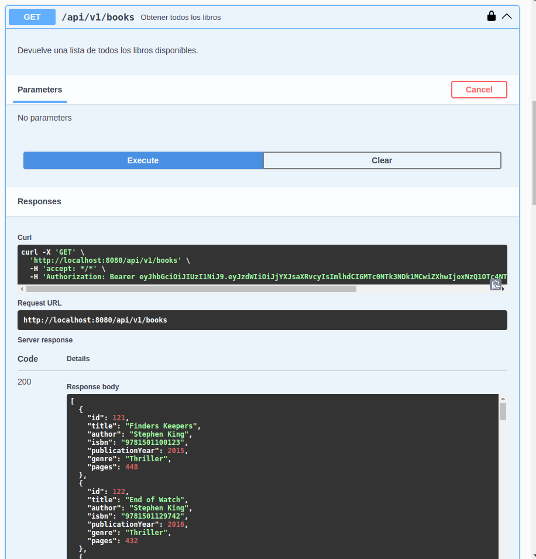
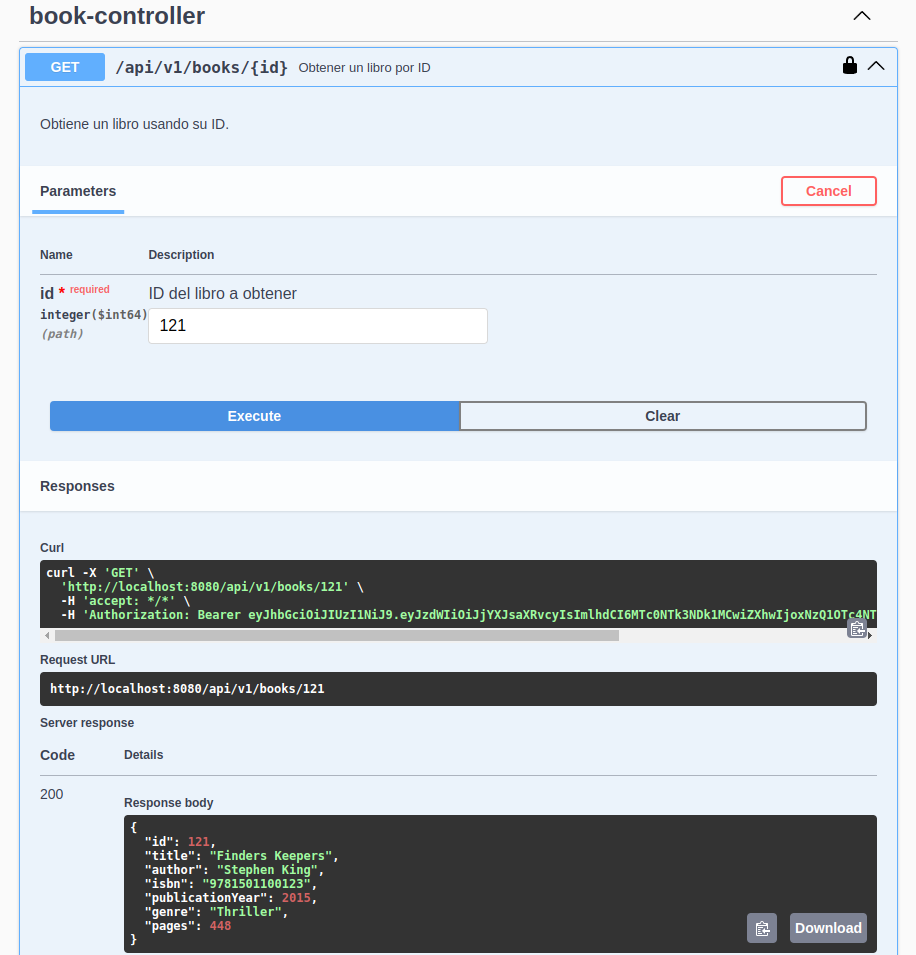

# **Tarea 2 (Advanced Web) (Adolfo)**

# **Advanced Web Tarea 2**

## Equipo #46

Carlos Iván Armenta Naranjo - A01643070

Jorge Javier Blásquez Gonzalez - A01637706 

Adolfo Hernández Signoret - A01637184

Arturo Ramos Martínez - A01643269

Moisés Adrián Cortés Ramos - A01642492

Bryan Ithan Landín Lara - A01636271

## 🚀 To run use:

```bash
git clone https://github.com/SludgyF/AdvancedWeb2.git
```
```
cd LibraryApi/LibraryManagement
```
```
mvn clean install
```
```
mvn spring-boot:run
```
# **Acceder a la documentacion**
http://localhost:8080/swagger-ui/index.html

# **Pruebas de la documentacion**

Dashboard de Swagger


Dashboard de Swagger


Inicio de sesion para obtener token


Obtenemos token


Autorizamos con token


Se confirma la autorizacion


Usamos endpoint de obtener todos los libros


Usamos endpoint de obtener un libro por ID
